# Awesome-Review-Management-Platform

## Top Review Management Platform

A curated list of leading **Review Management**, **Online Reputation Management (ORM)**, **Review Monitoring**, **Review Generation**, **Customer Feedback**, **Reputation Intelligence**, and **Review Marketing** platforms — with a strong emphasis on **open-source and self-hosted alternatives**.

> Review Management platforms collect, monitor, analyze, respond to, generate, and publish customer reviews across multiple channels such as Google, Facebook, Yelp, TripAdvisor, industry-specific directories, and first-party websites.
>
> Commercial platforms such as Birdeye, Podium, Yext, ReviewTrackers, NiceJob, Broadly, Grade.us, Trustpilot, Reputation and Synup combine review aggregation with review generation, response management, analytics, listings, messaging, customer feedback and reputation intelligence. For example, Birdeye aggregates reviews from hundreds of sites and supports centralized responses, while Yext provides review monitoring, response, generation and API capabilities.
>
> The open-source ecosystem is more fragmented. There are fewer complete drop-in equivalents to Birdeye or Reputation.com, but there are numerous self-hosted review/testimonial systems, social-listening tools, survey platforms, CRM/helpdesk systems, analytics platforms, workflow engines, and APIs that can be combined into a powerful open-source reputation-management platform.

---

# Table of Contents

* [What Is Review Management?](#what-is-review-management)
* [Core Review Management Capabilities](#core-review-management-capabilities)
* [SaaS / Hosted Platforms](#saas--hosted-platforms)
* [Open-Source](#open-source)
* [Open-Source Review Management Platforms](#open-source-review-management-platforms)
* [Open-Source Review and Testimonial Collection](#open-source-review-and-testimonial-collection)
* [Open-Source Social Listening and Reputation Monitoring](#open-source-social-listening-and-reputation-monitoring)
* [Open-Source Surveys and Customer Feedback](#open-source-surveys-and-customer-feedback)
* [Open-Source CRM and Customer Experience](#open-source-crm-and-customer-experience)
* [Open-Source Marketing Automation](#open-source-marketing-automation)
* [Open-Source Forms and Data Collection](#open-source-forms-and-data-collection)
* [Open-Source Analytics](#open-source-analytics)
* [Open-Source Automation and Integration](#open-source-automation-and-integration)
* [Open-Source AI and Sentiment Analysis](#open-source-ai-and-sentiment-analysis)
* [Open-Source Search and Data Infrastructure](#open-source-search-and-data-infrastructure)
* [Review Aggregation Architecture](#review-aggregation-architecture)
* [Review Generation Architecture](#review-generation-architecture)
* [Review Response Architecture](#review-response-architecture)
* [Reputation Intelligence Architecture](#reputation-intelligence-architecture)
* [Commercial → Open-Source Mapping](#commercial--open-source-mapping)
* [Capability Matrix](#capability-matrix)
* [Recommended Open-Source Stacks](#recommended-open-source-stacks)
* [What Open Source Can Replace](#what-open-source-can-replace)
* [What Open Source Cannot Replace Automatically](#what-open-source-cannot-replace-automatically)
* [Open-Source Review Platform Blueprint](#open-source-review-platform-blueprint)
* [Multi-Location Architecture](#multi-location-architecture)
* [Review Monitoring Workflow](#review-monitoring-workflow)
* [Review Generation Workflow](#review-generation-workflow)
* [Sentiment Analysis Workflow](#sentiment-analysis-workflow)
* [Review Response Workflow](#review-response-workflow)
* [Reputation Dashboard](#reputation-dashboard)
* [Security and Privacy](#security-and-privacy)
* [Licensing Considerations](#licensing-considerations)
* [Top Open-Source Shortlist](#top-open-source-shortlist)
* [Best Open-Source Stack](#best-open-source-stack)
* [Conclusion](#conclusion)

---

# What Is Review Management?

Review Management is the process of systematically:

```text
COLLECT
   ↓
AGGREGATE
   ↓
MONITOR
   ↓
ANALYZE
   ↓
RESPOND
   ↓
GENERATE
   ↓
PUBLISH
   ↓
LEARN
   ↓
IMPROVE
```

customer feedback and online reviews.

A modern review-management platform normally handles:

* Google reviews
* Facebook reviews
* Yelp reviews
* TripAdvisor reviews
* Industry-specific review sites
* First-party reviews
* Customer testimonials
* Review invitations
* SMS review requests
* Email review requests
* QR-code review campaigns
* Review monitoring
* Review response
* AI-assisted responses
* Sentiment analysis
* Topic analysis
* Competitor monitoring
* Location-level reporting
* Reputation scoring
* Review widgets
* Social publishing
* Customer feedback
* Surveys
* Listings
* Local SEO
* Customer messaging

---

# Core Review Management Capabilities

| Capability            | Description                                 |
| --------------------- | ------------------------------------------- |
| Review aggregation    | Collect reviews from multiple publishers    |
| Review monitoring     | Detect new reviews                          |
| Review alerts         | Notify teams of new reviews                 |
| Review response       | Reply from a central dashboard              |
| AI responses          | Generate response drafts                    |
| Review generation     | Request new reviews                         |
| SMS campaigns         | Send review invitations through SMS         |
| Email campaigns       | Send review invitations through email       |
| Feedback routing      | Route unhappy customers to private feedback |
| Sentiment analysis    | Determine positive/negative sentiment       |
| Topic analysis        | Identify recurring customer issues          |
| Reputation score      | Aggregate reputation indicators             |
| Competitor monitoring | Compare competitors                         |
| Multi-location        | Manage many locations                       |
| Review widgets        | Display reviews on websites                 |
| Review syndication    | Distribute content                          |
| Social sharing        | Publish reviews to social channels          |
| Listings management   | Manage business listings                    |
| Customer messaging    | Communicate with customers                  |
| CRM integration       | Connect customer records                    |
| API                   | Integrate with other systems                |
| Webhooks              | Trigger workflows                           |
| Analytics             | Measure reputation trends                   |
| White-label           | Agencies can rebrand the platform           |
| Approval workflow     | Moderate content before publishing          |

---

# SaaS / Hosted Platforms

> This section intentionally remains separate from the Open-Source section.
>
> The products below are commercial SaaS, cloud, hosted or enterprise platforms. Some are broader customer-experience or local-marketing platforms rather than pure review-management products.

---

## 1. Birdeye

**Website:** https://birdeye.com/

One of the broadest reputation and customer-experience platforms.

Birdeye supports review generation, review monitoring, centralized review management, automated responses, reputation analytics and multi-location workflows. Its current platform also emphasizes AI-driven review generation and response.

### Capabilities

* Review monitoring
* Review generation
* Review response
* AI review responses
* Reputation management
* Customer messaging
* Surveys
* Listings
* Webchat
* Multi-location management
* Analytics
* API integrations

**Best for:**

```text
Enterprise
+
Multi-location brands
+
Healthcare
+
Local businesses
+
Franchises
```

---

# 2. Podium

**Website:** https://www.podium.com/

Podium combines reviews with customer messaging and engagement.

Its Reviews product focuses on generating more reviews, automated invitations and AI-assisted review responses.

### Capabilities

* Review invitations
* SMS review requests
* AI review responses
* Customer messaging
* Webchat
* Payments
* Lead management
* Reputation management
* Multi-location support

**Best for:**

```text
Local Service Businesses
+
SMS-first Customer Engagement
```

---

# 3. Yext Reviews

**Website:** https://www.yext.com/

Yext Reviews provides centralized monitoring, response and review-generation capabilities across a broad publisher network. Yext currently describes its Reviews product as covering monitoring, response generation, publishing, approvals, sentiment and user-generated content.

### Capabilities

* Review monitoring
* Review generation
* Review response
* Sentiment
* Publisher network
* Listings
* Knowledge Graph
* API
* Multi-location management
* Approval workflows
* Reputation analytics

---

# 4. ReviewTrackers

**Website:** https://www.reviewtrackers.com/

ReviewTrackers focuses heavily on reputation management, review monitoring, review requests and customer feedback analytics.

The platform aggregates reviews from major directories, automates review requests and provides AI-assisted response capabilities.

### Capabilities

* Review monitoring
* Review generation
* Review response
* Sentiment analytics
* Smart response
* Customer feedback
* Reporting
* API
* Integrations

---

# 5. NiceJob

**Website:** https://nicejob.com/

NiceJob focuses on review generation, review management and customer-story marketing.

Its current product includes review insights, review requests, response capabilities, feedback routing, competitor insights and review-site integrations.

### Capabilities

* Review generation
* Review invitations
* Review monitoring
* Review responses
* Feedback routing
* Review insights
* Competitor insights
* Customer stories
* Marketing automation

---

# 6. Broadly

**Website:** https://broadly.com/

Broadly targets local service businesses with an integrated platform combining reviews, messaging, lead generation, websites, scheduling and AI.

Broadly describes automated SMS/email review requests, review management, local SEO and customer engagement as core functions.

### Capabilities

* Review generation
* Review monitoring
* Reputation management
* Customer messaging
* AI receptionist
* Web chat
* Appointment scheduling
* Local SEO
* Lead management
* Marketing automation

---

# 7. Grade.us

**Website:** https://www.grade.us/

Grade.us is particularly strong for agencies and white-label reputation management.

It supports automated review-generation campaigns, monitoring, responses, widgets, social sharing and multi-client management.

### Capabilities

* Review generation
* Review monitoring
* Review response
* White-label
* Agency management
* Multi-location
* Review widgets
* Social sharing
* Email/SMS campaigns
* Reporting

---

# 8. Trustpilot Business

**Website:** https://business.trustpilot.com/

Trustpilot is a major public review ecosystem as well as a business-facing review and feedback platform.

Its business offering includes customer review collection, engagement, trust signals, feedback insights, integrations and review-related data products.

### Capabilities

* Review collection
* Review invitations
* Review management
* Trust scores
* Review analytics
* Consumer trust signals
* Widgets
* API/data products
* Brand visibility

---

# 9. Reputation

**Website:** https://reputation.com/

Enterprise reputation-management platform for:

* Reviews
* Surveys
* Listings
* Social
* Customer experience
* Reputation analytics

---

# 10. Reputation.com

**Website:** https://reputation.com/

Reputation.com provides an enterprise-oriented reputation and customer-experience management platform.

### Capabilities

* Reviews
* Surveys
* Reputation analytics
* Listings
* Social listening
* Customer feedback
* Location intelligence
* Multi-location management

---

# 11. EmbedSocial

**Website:** https://embedsocial.com/

EmbedSocial specializes in collecting and displaying social proof and user-generated content.

### Capabilities

* Reviews
* Testimonials
* Social media feeds
* Review widgets
* UGC
* Social proof
* Embeddable widgets
* Review aggregation

---

# 12. Synup

**Website:** https://www.synup.com/

Synup combines:

* Local listings
* Reviews
* Local SEO
* Reputation
* Analytics
* Multi-location management

It is positioned as a local-marketing platform rather than only a review product.

---

# 13. GatherUp

**Website:** https://gatherup.com/

Review generation and reputation-management platform.

### Capabilities

* Review requests
* Review monitoring
* Customer feedback
* Surveys
* Reputation management
* Reporting

---

# 14. SOCi

**Website:** https://www.soci.ai/

Multi-location marketing platform with:

* Reputation management
* Reviews
* Social media
* Listings
* Local marketing
* AI

---

# 15. Birdeye Alternatives / Competitors

Other commercial platforms worth evaluating include:

* GatherUp
* Reputation
* SOCi
* Vendasta
* Thryv
* LocalClarity
* Chatmeter
* Rio SEO
* Brand24
* Mention
* Brandwatch
* Sprout Social
* Hootsuite
* Sprinklr
* ReviewPush
* ReviewInc
* TrueReview
* Weave
* HighLevel
* GoHighLevel
* Whitespark
* BrightLocal
* Semrush
* Moz Local

---

# Open-Source

> **Important:** The open-source market is considerably more fragmented than the commercial review-management market.
>
> There is currently no single open-source project that universally provides the full feature set of:
>
> ```text
> Birdeye
> +
> Podium
> +
> Yext
> +
> ReviewTrackers
> +
> Reputation.com
> +
> Trustpilot Business
> ```
>
> The practical open-source strategy is to combine:
>
> ```text
> Review Collection
> +
> Review Database
> +
> Review Monitoring
> +
> Social Listening
> +
> Surveys
> +
> CRM
> +
> Automation
> +
> Sentiment Analysis
> +
> Analytics
> +
> Website Widgets
> ```
>
> into one self-hosted reputation-management platform.

---

# Open-Source Review Management Platforms

## 1. reviewsup.io

**GitHub:** https://github.com/allenyan513/reviewsup.io

An open-source review and testimonial management platform designed for collecting, managing and displaying customer feedback.

### Features

* Review collection
* Testimonials
* Review dashboard
* Analytics
* Embeddable reviews
* API
* SDK
* Self-hosting
* Data ownership
* Docker support

The project explicitly positions itself as a self-hosted review/testimonial management system.

**Best for:**

```text
Self-hosted Review Collection
+
Testimonials
+
Embedded Reviews
```

---

# 2. Site Reviews

**GitHub:** https://github.com/common-repository/site-reviews

Open-source WordPress review-management plugin.

It provides review collection, moderation, verification, responses, widgets, blocks and shortcodes.

### Features

* Reviews
* Ratings
* Testimonials
* Moderation
* Review verification
* Review responses
* Widgets
* Shortcodes
* Blocks
* Review schema
* WordPress integration

**License:** GPLv3

---

# 3. Reviewskits

**GitHub:** https://github.com/reviews-kits-team/reviews-kits

Open-source, self-hosted testimonial/review platform.

### Features

* Review forms
* Review collection
* Moderation
* Dashboard
* Analytics
* REST API
* SDK
* Embeddable reviews
* Custom forms
* Self-hosting

The project describes itself as an open-source, self-hosted alternative to commercial testimonial platforms.

**License:** AGPL-3.0

---

# 4. vouchdock

**GitHub:** https://github.com/TBSKR/vouchdock

Open-source, self-hosted testimonial collection and moderation platform.

### Features

* Text testimonials
* Video testimonials
* Star ratings
* Collection forms
* Moderation
* Approval workflow
* Wall of Love
* Embedding
* JSON API
* SQLite
* Docker
* No external runtime telemetry

The project describes itself as an MIT-licensed self-hosted alternative to hosted testimonial platforms.

**License:** MIT

---

# 5. Creet.io

**GitHub:** https://github.com/creet/creet.io

Open-source testimonial collection and management platform.

### Features

* Testimonial collection
* Testimonial management
* Customer feedback
* Media
* Embedding
* Self-hosting
* PostgreSQL/Supabase ecosystem
* Optional video support

---

# 6. Testimate

**GitHub:** https://github.com/bishaln/testimate

Open-source testimonial collection platform.

### Features

* Testimonial collection
* Moderation
* Customer testimonials
* Display widgets
* Privacy
* Customization
* Self-hosting

---

# 7. Reeverb

**GitHub:** https://github.com/zaptech-dev/reeverb

Open-source self-hosted testimonial platform built with Rust.

### Features

* Testimonials
* Projects
* Tags
* Dashboard
* REST/OpenAPI
* PostgreSQL
* Self-hosting
* Embeddable social proof

The project is currently early-stage, so it should be evaluated accordingly.

---

# 8. Testiwall

**GitHub:** https://github.com/siinghd/testiwall

Self-hosted testimonial collection and "Wall of Love" platform.

### Features

* Text testimonials
* Video testimonials
* Moderation
* Approval
* Bulk actions
* Export
* Embeddable wall
* Webhooks
* Email modules
* Social-import modules

---

# 9. Review System

**GitHub:** https://github.com/vasrem/review-system

A lightweight open-source business feedback system.

### Features

* Review submission
* Admin dashboard
* Review management
* Automated email
* MongoDB
* Node.js
* Self-hosting

This is a simpler project and is better viewed as a customizable starting point than as a mature enterprise alternative.

---

# 10. Testimonial Platform

**GitHub:** https://github.com/Vishesh-Tripathi/-testimonial-platform

A full-stack testimonial collection and moderation application.

### Features

* Customer testimonials
* Moderation
* Dashboard
* Photos
* Embeddable widgets
* React
* Node.js
* MongoDB

---

# 11. TestimonialFlow

**GitHub:** https://github.com/AkrMcmr/testimonialflow

Open-source testimonial collection and display project.

### Workflow

```text
Share Link
    ↓
Customer submits testimonial
    ↓
Review
    ↓
Embed
    ↓
Website
```

---

# 12. Debrief

**GitHub:** https://github.com/anurieli/debrief

Self-hosted automated testimonial system.

### Workflow

```text
Video Request
      ↓
Customer Records Video
      ↓
AI Transcription
      ↓
AI Testimonial Generation
      ↓
Human Approval
      ↓
Website
```

MIT licensed according to its repository.

---

# Open-Source Review and Testimonial Collection

The following projects are particularly useful when the objective is:

```text
"Collect my own first-party customer reviews."
```

| Project      | Collection | Moderation | Embed | API | Video | Self-host |
| ------------ | ---------: | ---------: | ----: | --: | ----: | --------: |
| reviewsup.io |          ✅ |          ✅ |     ✅ |   ✅ |     ◐ |         ✅ |
| Reviewskits  |          ✅ |          ✅ |     ✅ |   ✅ |     ◐ |         ✅ |
| vouchdock    |          ✅ |          ✅ |     ✅ |   ✅ |     ✅ |         ✅ |
| Creet.io     |          ✅ |          ✅ |     ✅ |   ✅ |     ◐ |         ✅ |
| Testimate    |          ✅ |          ✅ |     ✅ |   ◐ |     ◐ |         ✅ |
| Reeverb      |          ✅ |          ✅ |     ◐ |   ✅ |     ❌ |         ✅ |
| Testiwall    |          ✅ |          ✅ |     ✅ |   ✅ |     ✅ |         ✅ |
| Site Reviews |          ✅ |          ✅ |     ✅ |   ◐ |     ◐ |         ✅ |

---

# Open-Source Social Listening and Reputation Monitoring

A complete Birdeye/Reputation.com alternative requires monitoring external sources.

## Apphera

**GitHub:** https://github.com/Kuew/social-media-monitoring-open-source

Apphera is an older open-source social-media monitoring and reputation-management platform.

Its described capabilities include:

* Online review tracking
* Competitor analysis
* Social-media monitoring
* SEO tracking
* Twitter data mining
* Facebook monitoring
* Reputation management

> **Status caution:** Apphera is historically significant but should be evaluated carefully for current maintenance and compatibility before production deployment.

---

# Open-Source Social Listening Stack

Rather than relying on a single project:

```text
Mastodon / Social APIs
        +
RSS
        +
Webhooks
        +
Custom API Collectors
        ↓
     Kafka
        ↓
   OpenSearch
        ↓
 Sentiment Analysis
        ↓
 Reputation Dashboard
```

Useful open-source components include:

* OpenSearch
* Elasticsearch
* Apache Kafka
* RabbitMQ
* NATS
* RSS readers
* Scrapy
* Playwright
* Selenium
* Beautiful Soup
* Huginn
* n8n
* Node-RED

---

# Open-Source Surveys and Customer Feedback

## LimeSurvey

**GitHub:** https://github.com/LimeSurvey/LimeSurvey

**Website:** https://www.limesurvey.org/

One of the most established open-source survey platforms.

### Useful for

* Customer satisfaction
* NPS
* CSAT
* Customer feedback
* Post-service surveys
* Feedback routing
* Research

---

# Formbricks

**GitHub:** https://github.com/formbricks/formbricks

Open-source survey and experience-management platform.

### Useful for

* NPS
* Surveys
* Feedback
* Product experience
* Customer feedback
* In-app surveys
* Website surveys

---

# SurveyJS

**GitHub:** https://github.com/surveyjs/survey-library

Developer-oriented open-source survey framework.

Useful for creating:

* Feedback forms
* NPS surveys
* CSAT
* Customer questionnaires
* Review-request workflows

---

# Open-Source CRM and Customer Experience

A review-management platform becomes much more useful when connected to customer records.

## SuiteCRM

**GitHub:** https://github.com/SuiteCRM/SuiteCRM

**Website:** https://suitecrm.com/

Useful for:

* Customer management
* Contacts
* Accounts
* Service history
* Campaigns
* Customer segmentation

---

# EspoCRM

**GitHub:** https://github.com/espocrm/espocrm

Open-source CRM platform useful for connecting:

```text
Customer
   ↓
Transaction
   ↓
Service
   ↓
Review Request
   ↓
Review
```

---

# Twenty CRM

**GitHub:** https://github.com/twentyhq/twenty

Modern open-source CRM.

Useful for:

* Customer profiles
* Contacts
* Accounts
* Workflows
* Custom fields
* Integrations

---

# Odoo Community

**GitHub:** https://github.com/odoo/odoo

Useful for integrating:

* CRM
* Sales
* Customer service
* Marketing
* Surveys
* Website
* Email
* Customer data

---

# Open-Source Marketing Automation

## Mautic

**GitHub:** https://github.com/mautic/mautic

Useful for automated review-generation campaigns.

Example:

```text
Completed Service
       ↓
Mautic
       ↓
Wait 24 Hours
       ↓
SMS / Email
       ↓
Review Request
       ↓
Google / First-Party Review
```

---

# Listmonk

**GitHub:** https://github.com/knadh/listmonk

Self-hosted newsletter and mailing-list platform.

Useful for:

* Review campaigns
* Customer follow-up
* Email campaigns
* Segmentation

---

# Postal

**GitHub:** https://github.com/postalserver/postal

Self-hosted mail delivery platform.

Useful for organizations wanting to control review-request email infrastructure.

---

# Open-Source Forms and Data Collection

## Formbricks

Useful for:

```text
NPS
+
CSAT
+
Feedback
+
Survey
+
Review Intent
```

---

## Typebot

**GitHub:** https://github.com/baptisteArno/typebot.io

Open-source conversational form builder.

Useful for:

* Feedback collection
* Customer qualification
* Review-request workflows
* Complaint routing

---

## NocoDB

**GitHub:** https://github.com/nocodb/nocodb

Turns databases into spreadsheet-style applications.

Useful for building:

```text
Customer Database
+
Review Database
+
Location Database
+
Campaign Database
```

---

## Baserow

**GitHub:** https://github.com/bramw/baserow

Open-source database and no-code platform.

Useful for rapid reputation-management prototypes.

---

# Open-Source Analytics

## Metabase

**GitHub:** https://github.com/metabase/metabase

Useful for:

* Review volume
* Average rating
* Sentiment
* Response rate
* Location performance
* Campaign conversion

---

# Apache Superset

**GitHub:** https://github.com/apache/superset

Useful for:

* Executive dashboards
* Multi-location reputation dashboards
* Review trends
* Competitive analytics

---

# Grafana

**GitHub:** https://github.com/grafana/grafana

Useful for real-time:

```text
Review Volume
Rating
Sentiment
Response Time
Review Requests
Conversion
```

---

# OpenSearch Dashboards

**GitHub:** https://github.com/opensearch-project/OpenSearch-Dashboards

Excellent for large-scale review and reputation-event analytics.

---

# Open-Source Automation and Integration

## n8n

**GitHub:** https://github.com/n8n-io/n8n

One of the most important building blocks for an open-source review-management platform.

Example:

```text
CRM
 ↓
n8n
 ↓
Customer completed service
 ↓
Wait
 ↓
Send review request
 ↓
Collect response
 ↓
Store review
 ↓
Analyze sentiment
 ↓
Notify team
```

---

# Node-RED

**GitHub:** https://github.com/node-red/node-red

Useful for event-driven review workflows.

---

# Huginn

**GitHub:** https://github.com/huginn/huginn

Agent-based automation system.

Potential uses:

* Website monitoring
* RSS monitoring
* Keyword alerts
* Competitor monitoring
* Review-source monitoring
* Notification workflows

---

# Open-Source AI and Sentiment Analysis

A modern review-management platform needs NLP.

## Hugging Face Transformers

**GitHub:** https://github.com/huggingface/transformers

Useful for:

* Sentiment classification
* Topic extraction
* Summarization
* Review classification
* Response generation
* Language detection

---

# spaCy

**GitHub:** https://github.com/explosion/spaCy

Useful for:

* NLP pipelines
* Entity extraction
* Text classification
* Topic processing

---

# scikit-learn

**GitHub:** https://github.com/scikit-learn/scikit-learn

Useful for:

* Sentiment models
* Review classification
* Churn prediction
* Customer segmentation
* Anomaly detection

---

# PyTorch

**GitHub:** https://github.com/pytorch/pytorch

Useful for custom review intelligence models.

---

# Ollama

**GitHub:** https://github.com/ollama/ollama

Useful for locally hosted LLM-powered:

* Review summarization
* Response generation
* Sentiment analysis
* Topic extraction
* Complaint classification
* Review categorization

---

# Open-Source Search and Data Infrastructure

## PostgreSQL

**Website:** https://www.postgresql.org/

Primary transactional database.

Store:

```text
Customers
Locations
Reviews
Ratings
Campaigns
Responses
Sentiment
Topics
Users
Permissions
```

---

# Redis

**Website:** https://redis.io/

Useful for:

* Caching
* Rate limiting
* Queues
* Real-time reputation scores
* Job state

---

# OpenSearch

Useful for full-text review search:

```text
Search:
"billing problem"
"waiting time"
"poor service"
"friendly staff"
"doctor"
"delivery"
```

---

# Apache Kafka

Useful when thousands or millions of review events need to be processed.

```text
Review Sources
     ↓
   Kafka
     ↓
 ┌───┼────┬───────┐
 ↓   ↓    ↓       ↓
NLP DB  Alerts Analytics
```

---

# Review Aggregation Architecture

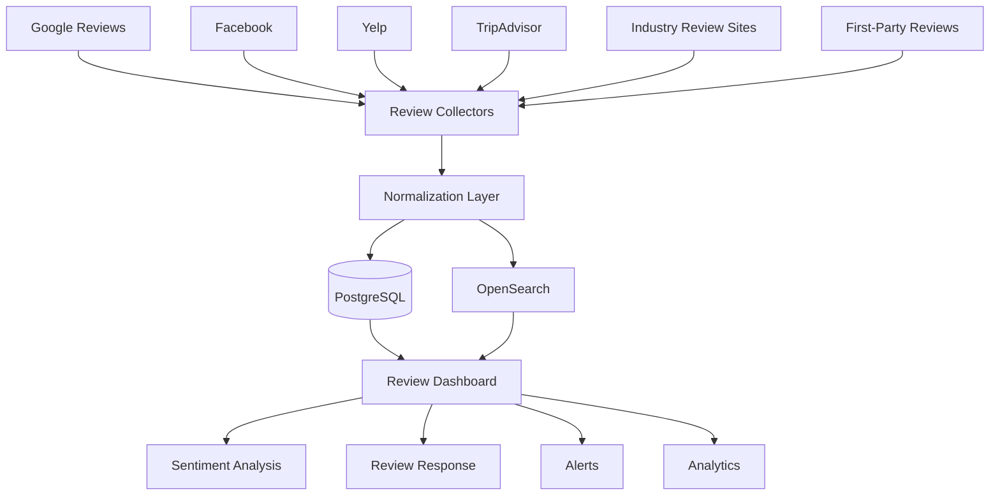

---

# Review Generation Architecture

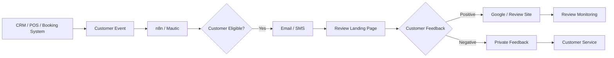

---

# Review Response Architecture

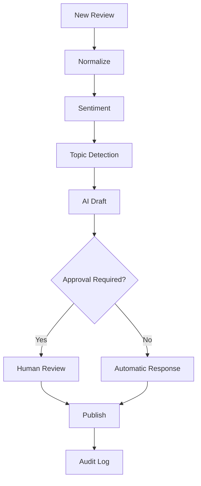

---

# Reputation Intelligence Architecture

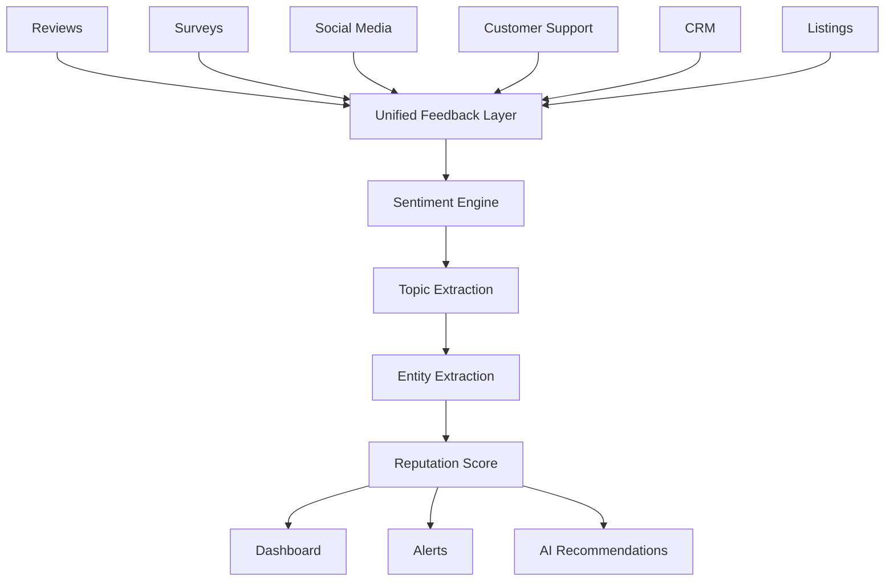

---

# Commercial → Open-Source Mapping

| Commercial Platform           | Open-Source / Self-Hosted Equivalent                                |
| ----------------------------- | ------------------------------------------------------------------- |
| **Birdeye**                   | Reviewskits/reviewsup.io + n8n + OpenSearch + Formbricks + Metabase |
| **Podium**                    | Key CRM + n8n + Mautic + review collection + messaging stack        |
| **Yext Reviews**              | Review aggregation + OpenSearch + NocoDB/PostgreSQL + Metabase      |
| **ReviewTrackers**            | Apphera + OpenSearch + n8n + sentiment/NLP                          |
| **NiceJob**                   | reviewsup.io + Mautic + n8n + AI/NLP                                |
| **Broadly**                   | CRM + Mautic + n8n + reviewsup.io + messaging                       |
| **Grade.us**                  | Reviewskits + Site Reviews + white-label frontend + n8n             |
| **Trustpilot Business**       | Site Reviews + reviewsup.io + review widgets + OpenSearch           |
| **Reputation**                | OpenSearch + MISP-like data aggregation + NLP + Metabase            |
| **Reputation.com**            | OpenSearch + Formbricks + CRM + review collectors                   |
| **EmbedSocial**               | reviewsup.io + Reviewskits + embeddable widgets                     |
| **Synup**                     | NocoDB/Baserow + review collectors + OpenSearch + local SEO tools   |
| **GatherUp**                  | Reviewskits + n8n + Mautic + CRM                                    |
| **SOCi**                      | CRM + n8n + OpenSearch + social APIs                                |
| **Review generation**         | Mautic + n8n + Twilio-compatible SMS provider                       |
| **Review analytics**          | OpenSearch + Metabase / Superset                                    |
| **AI review responses**       | Ollama + LLM + approval workflow                                    |
| **Customer surveys**          | Formbricks / LimeSurvey                                             |
| **Reputation database**       | PostgreSQL                                                          |
| **Searchable review archive** | OpenSearch                                                          |

---

# Capability Matrix

| Platform       | Reviews | Generation | Response | Sentiment | AI | Multi-Location | White Label | Open Source |
| -------------- | ------: | ---------: | -------: | --------: | -: | -------------: | ----------: | ----------: |
| Birdeye        |       ✅ |          ✅ |        ✅ |         ✅ |  ✅ |              ✅ |           ◐ |           ❌ |
| Podium         |       ✅ |          ✅ |        ✅ |         ✅ |  ✅ |              ✅ |           ❌ |           ❌ |
| Yext           |       ✅ |          ✅ |        ✅ |         ✅ |  ✅ |              ✅ |           ◐ |           ❌ |
| ReviewTrackers |       ✅ |          ✅ |        ✅ |         ✅ |  ✅ |              ✅ |           ◐ |           ❌ |
| NiceJob        |       ✅ |          ✅ |        ✅ |         ✅ |  ✅ |              ✅ |           ◐ |           ❌ |
| Broadly        |       ✅ |          ✅ |        ✅ |         ◐ |  ✅ |              ✅ |           ❌ |           ❌ |
| Grade.us       |       ✅ |          ✅ |        ✅ |         ✅ |  ◐ |              ✅ |           ✅ |           ❌ |
| Trustpilot     |       ✅ |          ✅ |        ✅ |         ✅ |  ✅ |              ◐ |           ❌ |           ❌ |
| Reputation     |       ✅ |          ✅ |        ✅ |         ✅ |  ✅ |              ✅ |           ◐ |           ❌ |
| EmbedSocial    |       ✅ |          ◐ |        ◐ |         ◐ |  ◐ |              ◐ |           ◐ |           ❌ |
| Synup          |       ✅ |          ✅ |        ✅ |         ✅ |  ◐ |              ✅ |           ◐ |           ❌ |
| reviewsup.io   |       ✅ |          ◐ |        ✅ |         ◐ |  ◐ |              ◐ |           ◐ |           ✅ |
| Reviewskits    |       ✅ |          ◐ |        ◐ |         ◐ |  ◐ |              ◐ |           ◐ |           ✅ |
| Site Reviews   |       ✅ |          ◐ |        ✅ |         ◐ |  ❌ |              ◐ |           ◐ |           ✅ |
| vouchdock      |       ✅ |          ❌ |        ◐ |         ❌ |  ❌ |              ❌ |           ◐ |           ✅ |
| Apphera        |       ✅ |          ◐ |        ◐ |         ◐ |  ❌ |              ◐ |           ◐ |           ✅ |
| Formbricks     |       ◐ |          ❌ |        ❌ |         ◐ |  ◐ |              ◐ |           ◐ |           ✅ |
| Mautic         |       ❌ |          ✅ |        ❌ |         ◐ |  ◐ |              ✅ |           ◐ |           ✅ |
| OpenSearch     |       ◐ |          ❌ |        ❌ |         ◐ |  ◐ |              ✅ |           ❌ |           ✅ |
| Metabase       |       ◐ |          ❌ |        ❌ |         ◐ |  ◐ |              ✅ |           ❌ |           ✅ |

Legend:

```text
✅ = Strong/native capability
◐ = Possible through integration/customization
❌ = Not the primary capability
```

---

# Recommended Open-Source Stacks

# 1. Best Overall Review Management

```text
reviewsup.io
+
n8n
+
Mautic
+
PostgreSQL
+
OpenSearch
+
Metabase
+
Ollama
+
Formbricks
```

### Architecture

```text
Customer
   ↓
CRM
   ↓
n8n
   ↓
Mautic
   ↓
Email / SMS
   ↓
Review
   ↓
reviewsup.io
   ↓
OpenSearch
   ↓
Ollama
   ↓
Sentiment / Topic
   ↓
Metabase
```

---

# 2. Best Enterprise Open-Source Architecture

```text
PostgreSQL
+
OpenSearch
+
Kafka
+
n8n
+
Mautic
+
Formbricks
+
Ollama
+
Hugging Face
+
Metabase
+
Grafana
+
CRM
```

Best for:

```text
Multi-location
+
High Review Volume
+
Enterprise Analytics
+
AI
```

---

# 3. Best WordPress Architecture

```text
WordPress
+
Site Reviews
+
WooCommerce
+
Mautic
+
n8n
+
OpenSearch
+
Metabase
```

Best for:

* Local businesses
* Clinics
* Restaurants
* Professional services
* E-commerce

---

# 4. Best Agency / White-Label Architecture

```text
Reviewskits
+
Site Reviews
+
NocoDB
+
n8n
+
Mautic
+
Metabase
+
Custom White-Label Frontend
```

### Multi-client structure

```text
Agency
 │
 ├── Client A
 │    ├── Location 1
 │    ├── Location 2
 │    └── Location 3
 │
 ├── Client B
 │    ├── Location 1
 │    └── Location 2
 │
 └── Client C
      ├── Location 1
      ├── Location 2
      └── Location 3
```

---

# 5. Best AI Review Management Stack

```text
PostgreSQL
+
OpenSearch
+
reviewsup.io
+
n8n
+
Ollama
+
LlamaIndex
+
Hugging Face
+
Metabase
```

### AI pipeline

```text
Review
  ↓
Language Detection
  ↓
Sentiment
  ↓
Topic Extraction
  ↓
Entity Extraction
  ↓
Customer Intent
  ↓
Response Generation
  ↓
Human Approval
  ↓
Publish
```

---

# 6. Best Lightweight Stack

```text
Site Reviews
+
WordPress
+
n8n
+
PostgreSQL
+
Metabase
```

Suitable for:

```text
Small Business
+
Single Location
+
Simple Review Collection
```

---

# What Open Source Can Replace

With enough integration and development, open-source software can reproduce many core review-management functions.

## Review Collection

```text
First-party reviews
+
Testimonials
+
Feedback forms
+
NPS
+
CSAT
```

---

## Review Monitoring

Possible using:

```text
APIs
+
Webhooks
+
RSS
+
Custom collectors
+
OpenSearch
+
n8n
```

---

## Review Analytics

Possible using:

```text
PostgreSQL
+
OpenSearch
+
Metabase
+
Superset
+
Grafana
```

---

## Sentiment Analysis

Possible using:

```text
Hugging Face
+
spaCy
+
PyTorch
+
scikit-learn
+
Ollama
```

---

## AI Review Responses

Possible using:

```text
Ollama
+
LlamaIndex
+
Prompt Templates
+
Human Approval
```

---

## Review Generation

Possible using:

```text
CRM
+
Mautic
+
n8n
+
Email
+
SMS Provider
+
QR Codes
```

---

## Reputation Dashboard

Possible using:

```text
OpenSearch
+
Metabase
+
Grafana
+
PostgreSQL
```

---

# What Open Source Cannot Replace Automatically

The largest gap between an open-source stack and platforms such as Birdeye, Yext or Reputation.com is **data access**.

Open-source software does not automatically provide authorized access to every external review network.

The biggest challenges are:

* Google API restrictions
* Yelp API limitations
* Facebook/Meta API policies
* TripAdvisor integrations
* Publisher-specific APIs
* Authentication
* Rate limits
* Review-content licensing
* Review deletion/modification rules
* Location verification
* API changes
* Terms of service

Therefore:

```text
Open-source software
        ≠
Unlimited review scraping
```

A production platform should use:

```text
Official APIs
+
Authorized integrations
+
Webhooks
+
User-provided data
```

where available.

---

# The Major Open-Source Gap

Commercial platforms often provide:

```text
Hundreds of integrations
        +
Publisher relationships
        +
Location management
        +
Review APIs
        +
Review generation
        +
AI
        +
Analytics
```

Open-source projects generally provide the software infrastructure but not the commercial publisher network.

Therefore the open-source replacement should be viewed as:

```text
Software Platform
+
Integration Layer
+
Data Connectors
```

rather than a single GitHub repository.

---

# Open-Source Review Platform Blueprint

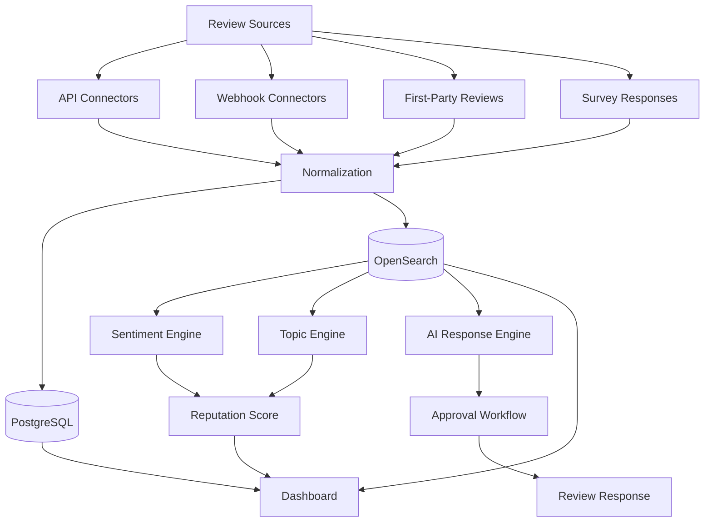

---

# Multi-Location Architecture

For franchises and enterprise organizations:

```text
Enterprise
   │
   ├── Brand
   │
   ├── Region
   │    ├── East
   │    ├── West
   │    └── North
   │
   └── Locations
        ├── Location A
        ├── Location B
        ├── Location C
        └── Location D
```

Database model:

```text
Organization
    ↓
Brand
    ↓
Region
    ↓
Location
    ↓
Customer
    ↓
Transaction
    ↓
Review
```

---

# Review Monitoring Workflow

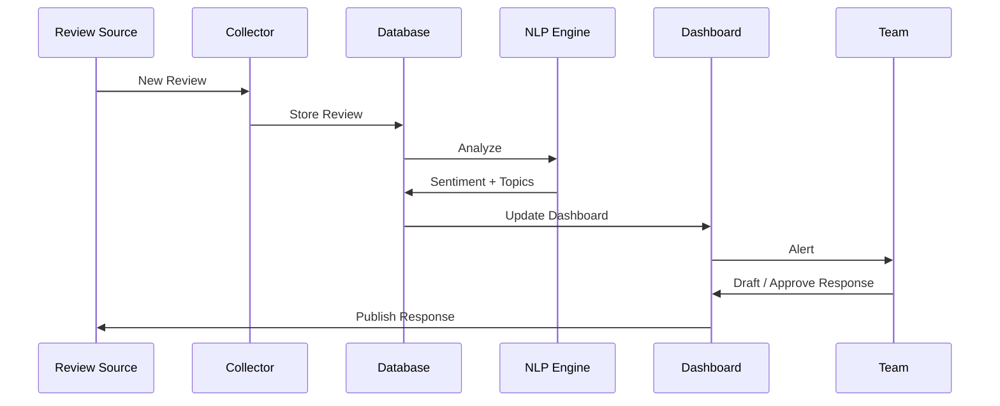

---

# Review Generation Workflow

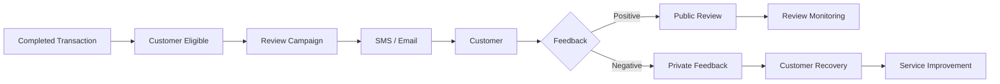

---

# Sentiment Analysis Workflow

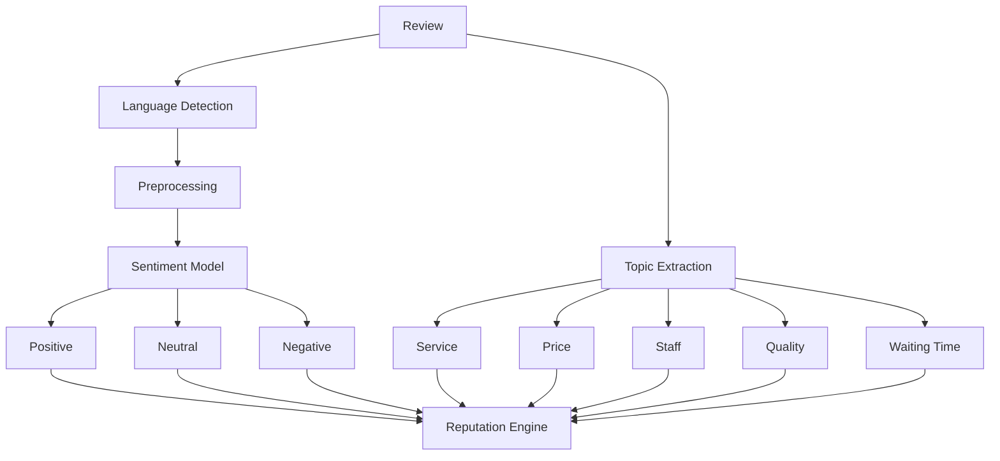

---

# Review Response Workflow

A production response engine should not simply generate text.

Recommended workflow:

```text
New Review
   ↓
Sentiment
   ↓
Topic
   ↓
Customer History
   ↓
Business Policy
   ↓
AI Draft
   ↓
Compliance Check
   ↓
Human Approval
   ↓
Publish
```

---

# AI Review Response Example

Input:

```text
Rating: 2/5

"The food was good but we waited almost
45 minutes before our order arrived."
```

AI analysis:

```text
Sentiment: Negative
Primary Topic: Waiting Time
Secondary Topic: Food Quality
Urgency: Medium
```

Suggested response:

```text
Thank you for your feedback. We're glad you enjoyed
the food, but we're sorry that the wait was longer
than it should have been. We've shared your feedback
with our team so we can improve our service times.
```

The final response should preferably be reviewed according to the organization's policy.

---

# Reputation Dashboard

A complete dashboard can include:

```text
┌────────────────────────────────────────────┐
│              REPUTATION                    │
├────────────────────────────────────────────┤
│                                            │
│  ★ 4.6       Reviews: 12,483              │
│                                            │
│  +18% Review Growth                        │
│                                            │
│  Positive       82%                        │
│  Neutral        11%                        │
│  Negative        7%                        │
│                                            │
├────────────────────────────────────────────┤
│ Location Performance                       │
│                                            │
│ Kolkata        ★ 4.8                       │
│ Delhi          ★ 4.6                       │
│ Mumbai         ★ 4.4                       │
│ Bangalore      ★ 4.7                       │
│                                            │
├────────────────────────────────────────────┤
│ Top Topics                                 │
│                                            │
│ Service       ██████████████               │
│ Staff         ███████████                  │
│ Quality       █████████                    │
│ Waiting       ██████                       │
│ Price         █████                        │
└────────────────────────────────────────────┘
```

---

# Reputation Score

A custom reputation score can combine:

```text
Average Rating
+
Review Volume
+
Review Recency
+
Response Rate
+
Response Time
+
Sentiment
+
Location Performance
+
Competitor Performance
```

Example:

```text
Reputation Score =

0.30 × Rating Score
+
0.20 × Review Volume
+
0.15 × Recency
+
0.15 × Sentiment
+
0.10 × Response Rate
+
0.10 × Response Time
```

> This is an illustrative model. Production weights should be calibrated to the organization's goals.

---

# Review Quality Metrics

Important KPIs include:

| Metric                    | Meaning                              |
| ------------------------- | ------------------------------------ |
| Average rating            | Overall star rating                  |
| Review volume             | Number of reviews                    |
| Review velocity           | New reviews over time                |
| Response rate             | Percentage responded to              |
| Response time             | Time to respond                      |
| Sentiment                 | Overall customer sentiment           |
| Negative-review rate      | Share of negative reviews            |
| Review-request conversion | Requests → reviews                   |
| NPS                       | Customer loyalty                     |
| CSAT                      | Customer satisfaction                |
| Location score            | Individual location reputation       |
| Competitor gap            | Difference from competitors          |
| Topic frequency           | Most common customer issues          |
| Resolution rate           | Complaints resolved                  |
| Review recovery           | Negative → improved customer outcome |

---

# Competitor Intelligence

An open-source platform can compare:

```text
Your Business
     VS
Competitor A
     VS
Competitor B
     VS
Competitor C
```

Metrics:

```text
Rating
Review Count
Review Velocity
Sentiment
Topics
Response Rate
Response Speed
```

Example:

| Business      | Rating | Reviews | Monthly New | Negative % |
| ------------- | -----: | ------: | ----------: | ---------: |
| Your Business |    4.6 |  12,400 |         320 |         7% |
| Competitor A  |    4.4 |  18,200 |         290 |        12% |
| Competitor B  |    4.7 |   9,800 |         180 |         5% |

---

# Review Recovery

One of the most valuable capabilities of a reputation platform is converting negative feedback into service improvement.

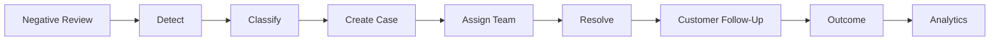

This transforms review management from:

```text
"Reply to reviews"
```

into:

```text
"Use reviews to improve the business."
```

---

# Customer Feedback → Operational Intelligence

```text
Reviews
   ↓
Sentiment
   ↓
Topics
   ↓
Problems
   ↓
Departments
   ↓
Root Cause
   ↓
Corrective Action
   ↓
Customer Experience
```

Example:

```text
500 reviews
   ↓
120 mention waiting time
   ↓
90 mention weekend waiting
   ↓
Restaurant staffing issue
   ↓
Change staffing schedule
   ↓
Waiting-time complaints decline
```

---

# Event-Driven Architecture

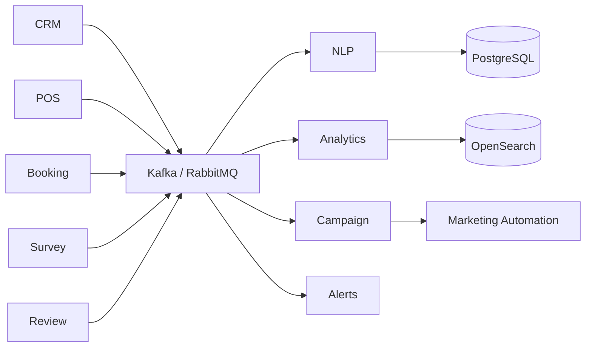

---

# API-First Architecture

A good open-source implementation should expose:

```text
POST /reviews
GET  /reviews
GET  /reviews/:id
PATCH /reviews/:id
DELETE /reviews/:id

POST /review-requests
GET  /review-requests

POST /sentiment/analyze
POST /response/generate

GET /locations
GET /customers

GET /analytics/reputation
GET /analytics/sentiment
GET /analytics/topics

POST /webhooks/review
```

---

# Suggested Review Data Model

```text
Organization
    |
    +-- Brand
          |
          +-- Location
                |
                +-- Customer
                |
                +-- Transaction
                |
                +-- Review
                |      |
                |      +-- Rating
                |      +-- Sentiment
                |      +-- Topics
                |      +-- Response
                |
                +-- Campaign
                       |
                       +-- Email
                       +-- SMS
                       +-- QR
```

---

# Suggested Review Schema

```json
{
  "id": "review_123",
  "organization_id": "org_001",
  "location_id": "loc_001",
  "customer_id": "cust_123",
  "source": "google",
  "rating": 4,
  "text": "Excellent service and friendly staff.",
  "language": "en",
  "sentiment": "positive",
  "topics": [
    "service",
    "staff"
  ],
  "response_status": "pending",
  "created_at": "2026-09-10T10:00:00Z"
}
```

---

# Review Source Adapter Architecture

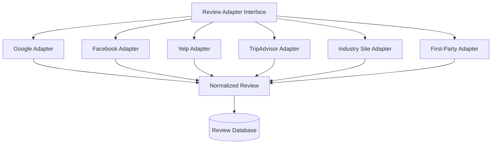

This approach avoids hard-coding the entire platform around one review publisher.

---

# Multi-Tenant Architecture

For a SaaS-like open-source deployment:

```text
                    PLATFORM
                       │
        ┌──────────────┼──────────────┐
        │              │              │
     Tenant A       Tenant B       Tenant C
        │              │              │
     Brand A        Brand B        Brand C
        │              │              │
    Locations      Locations      Locations
```

Tenant isolation should cover:

* Users
* Locations
* Reviews
* Customers
* Campaigns
* API credentials
* Reports
* AI settings
* Integrations

---

# Security and Privacy

Review-management platforms often process personal information.

Potential data includes:

* Customer names
* Email addresses
* Phone numbers
* Review text
* Photos
* Video
* Location
* Transaction information
* Customer-service conversations

Recommended controls:

```text
Encryption
+
RBAC
+
Tenant Isolation
+
Audit Logs
+
API Authentication
+
Secret Management
+
Rate Limiting
+
Data Retention
+
Backups
+
Access Reviews
```

---

# Privacy

An open-source platform provides an important advantage:

```text
Customer Data
      ↓
Your Infrastructure
      ↓
Your Database
      ↓
Your Retention Policy
```

rather than automatically sending all customer-feedback data to a third-party SaaS provider.

However, self-hosting also transfers responsibility for:

* Security
* Backups
* Updates
* Monitoring
* Compliance
* Access control
* Incident response

---

# Review Authenticity

A review-management platform should avoid deceptive practices.

Recommended principles:

```text
Request reviews from real customers
+
Do not fabricate reviews
+
Do not alter customer statements deceptively
+
Do not selectively suppress legitimate negative feedback
+
Clearly disclose incentives
+
Respect publisher policies
```

---

# Licensing Considerations

Always verify the current license before commercial deployment.

Examples in this ecosystem include:

```text
MIT
GPL
AGPL
Apache-2.0
Commercial
Open Core
Source Available
```

Not every GitHub project described as "open source" is equally mature, maintained or production-ready.

Particularly evaluate:

* License
* Last release
* Commit activity
* Number of maintainers
* Security policy
* Dependency health
* Documentation
* API stability
* Database migration support
* Backup/restore capability

---

# Open-Source Maturity Categories

## Production-oriented

Potential foundations:

* Site Reviews
* Formbricks
* LimeSurvey
* Mautic
* n8n
* PostgreSQL
* OpenSearch
* Metabase
* Grafana
* Hugging Face ecosystem

## Promising specialized projects

* reviewsup.io
* Reviewskits
* vouchdock
* Creet.io
* Testimate
* Testiwall
* Reeverb

## Experimental / project-specific

* Review System
* Testimonial Platform
* TestimonialFlow
* Debrief

## Legacy / evaluate carefully

* Apphera

---

# Top Open-Source Shortlist

## Tier 1 — Core Review Platforms

| Project          | Primary Use                       |
| ---------------- | --------------------------------- |
| **reviewsup.io** | Review/testimonial management     |
| **Reviewskits**  | Self-hosted review collection     |
| **Site Reviews** | WordPress review management       |
| **vouchdock**    | Testimonials + video + moderation |
| **Creet.io**     | Testimonial collection            |
| **Testimate**    | Testimonials                      |
| **Testiwall**    | Testimonials + Wall of Love       |

---

# Tier 2 — Reputation Infrastructure

| Project        | Primary Use                 |
| -------------- | --------------------------- |
| **OpenSearch** | Review search + analytics   |
| **Metabase**   | BI dashboards               |
| **Grafana**    | Monitoring                  |
| **Formbricks** | Surveys + feedback          |
| **LimeSurvey** | Customer surveys            |
| **Mautic**     | Review-generation campaigns |
| **n8n**        | Workflow automation         |
| **NocoDB**     | Review/customer database    |
| **Baserow**    | No-code database            |

---

# Tier 3 — AI / NLP

| Project                       | Primary Use      |
| ----------------------------- | ---------------- |
| **Ollama**                    | Local LLM        |
| **Hugging Face Transformers** | NLP              |
| **spaCy**                     | NLP              |
| **PyTorch**                   | ML               |
| **scikit-learn**              | ML               |
| **LlamaIndex**                | AI data/RAG      |
| **LangChain**                 | AI orchestration |

---

# Tier 4 — Infrastructure

| Project        | Primary Use     |
| -------------- | --------------- |
| **PostgreSQL** | Database        |
| **Redis**      | Cache/state     |
| **Kafka**      | Event streaming |
| **RabbitMQ**   | Messaging       |
| **MinIO**      | Object storage  |
| **Docker**     | Deployment      |
| **Kubernetes** | Orchestration   |

---

# Best Open-Source Choice by Requirement

| Requirement                   | Recommended                     |
| ----------------------------- | ------------------------------- |
| First-party review collection | **reviewsup.io**                |
| Self-hosted testimonials      | **Reviewskits**                 |
| WordPress review management   | **Site Reviews**                |
| Video testimonials            | **vouchdock / Testiwall**       |
| Survey / NPS                  | **Formbricks / LimeSurvey**     |
| Review campaign automation    | **n8n + Mautic**                |
| Review search                 | **OpenSearch**                  |
| BI                            | **Metabase**                    |
| Monitoring                    | **Grafana**                     |
| AI response generation        | **Ollama**                      |
| NLP                           | **Hugging Face / spaCy**        |
| Customer database             | **PostgreSQL**                  |
| No-code database              | **NocoDB / Baserow**            |
| Event streaming               | **Kafka**                       |
| Workflow automation           | **n8n**                         |
| Social/reputation monitoring  | **Apphera + custom collectors** |

---

# Closest Open-Source Equivalent to Birdeye

There is no single drop-in replacement.

The closest architecture is:

```text
reviewsup.io
+
n8n
+
Mautic
+
OpenSearch
+
Ollama
+
Metabase
+
Formbricks
+
PostgreSQL
```

### Feature mapping

```text
Birdeye Review Collection
        ↓
reviewsup.io

Review Campaigns
        ↓
Mautic + n8n

Review Monitoring
        ↓
OpenSearch + Connectors

AI Response
        ↓
Ollama

Sentiment
        ↓
Hugging Face

Analytics
        ↓
Metabase

Customer Feedback
        ↓
Formbricks
```

---

# Closest Open-Source Equivalent to Podium

Podium combines reviews, messaging and customer communication.

A self-hosted architecture:

```text
CRM
+
n8n
+
Mautic
+
reviewsup.io
+
SMS Provider
+
Email Provider
+
OpenSearch
```

---

# Closest Open-Source Equivalent to Yext Reviews

Yext combines reviews with a broader knowledge/listings ecosystem.

A self-hosted equivalent:

```text
Review Collectors
+
PostgreSQL
+
OpenSearch
+
NocoDB
+
n8n
+
Metabase
+
Custom Listings Database
```

---

# Closest Open-Source Equivalent to ReviewTrackers

```text
Review Collectors
+
OpenSearch
+
PostgreSQL
+
Hugging Face
+
n8n
+
Metabase
```

---

# Closest Open-Source Equivalent to NiceJob

```text
reviewsup.io
+
Mautic
+
n8n
+
Ollama
+
OpenSearch
```

---

# Closest Open-Source Equivalent to Broadly

Because Broadly combines reviews with communication and local-business workflows:

```text
CRM
+
Mautic
+
n8n
+
reviewsup.io
+
Formbricks
+
Messaging Provider
+
Metabase
```

---

# Closest Open-Source Equivalent to Grade.us

Grade.us is particularly agency/white-label oriented.

Recommended:

```text
Reviewskits
+
Site Reviews
+
NocoDB
+
n8n
+
Metabase
+
Custom White-Label Frontend
```

---

# Closest Open-Source Equivalent to Trustpilot Business

Trustpilot's public review ecosystem is difficult to reproduce because its value comes partly from its large independent review network.

For a first-party/self-hosted equivalent:

```text
reviewsup.io
+
Reviewskits
+
PostgreSQL
+
OpenSearch
+
Review Widgets
+
AI/NLP
```

---

# Closest Open-Source Equivalent to Reputation.com

```text
OpenSearch
+
PostgreSQL
+
Formbricks
+
Review Collectors
+
Social Listening
+
NLP
+
Metabase
+
n8n
```

---

# Closest Open-Source Equivalent to Synup

Synup combines reviews with local marketing and listings.

Recommended:

```text
NocoDB
+
PostgreSQL
+
OpenSearch
+
Review Collectors
+
n8n
+
Metabase
+
Local SEO Data
```

---

# Complete Open-Source Review Management Platform

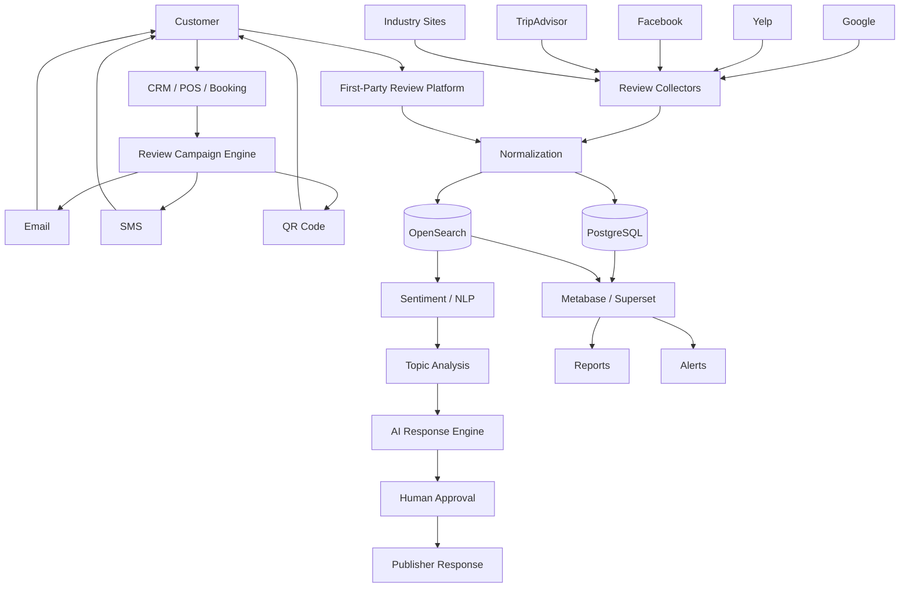

---

# The Ideal Open-Source Review Management Stack

```text
                       CUSTOMERS
                           │
                           ▼
                ┌────────────────────┐
                │ CRM / POS / Booking│
                └─────────┬──────────┘
                          │
                          ▼
                ┌────────────────────┐
                │   n8n / Mautic     │
                │ Campaign Engine    │
                └─────────┬──────────┘
                          │
                 ┌────────┼────────┐
                 ▼        ▼        ▼
               EMAIL      SMS      QR
                 │        │        │
                 └────────┼────────┘
                          ▼
                 ┌─────────────────┐
                 │ REVIEW PLATFORM │
                 │ reviewsup.io /  │
                 │ Reviewskits     │
                 └────────┬────────┘
                          │
                          ▼
                 ┌─────────────────┐
                 │   PostgreSQL    │
                 └────────┬────────┘
                          │
                          ▼
                 ┌─────────────────┐
                 │   OpenSearch    │
                 └────────┬────────┘
                          │
             ┌────────────┼────────────┐
             ▼            ▼            ▼
        Sentiment       Topics         AI
             │            │            │
             └────────────┼────────────┘
                          ▼
                 ┌─────────────────┐
                 │    Metabase     │
                 │    Grafana      │
                 └─────────────────┘
```

---

# Recommended Deployment

## Docker Compose

Ideal for:

```text
Small / Medium Business
+
Agencies
+
Development
+
Private Cloud
```

Example:

```yaml
services:

  postgres:
    image: postgres

  redis:
    image: redis

  opensearch:
    image: opensearchproject/opensearch

  n8n:
    image: n8nio/n8n

  reviews:
    image: your-review-platform

  metabase:
    image: metabase/metabase
```

---

# Kubernetes Architecture

For enterprise-scale deployment:

```text
                    Ingress
                       │
                       ▼
                Review API
                       │
          ┌────────────┼────────────┐
          ▼            ▼            ▼
       Review       Campaign      AI/NLP
       Service       Service      Service
          │            │            │
          └────────────┼────────────┘
                       ▼
                    Kafka
                       │
        ┌──────────────┼──────────────┐
        ▼              ▼              ▼
   PostgreSQL       OpenSearch       Redis
        │              │
        └──────────────┼──────────────┘
                       ▼
                 Analytics API
                       │
                       ▼
                 Metabase/Grafana
```

---

# Review Management Maturity Model

```text
LEVEL 1
Collect Reviews
       ↓
LEVEL 2
Monitor Reviews
       ↓
LEVEL 3
Respond to Reviews
       ↓
LEVEL 4
Generate Reviews
       ↓
LEVEL 5
Sentiment & Topic Analysis
       ↓
LEVEL 6
AI-Assisted Reputation Management
       ↓
LEVEL 7
Customer Experience Intelligence
       ↓
LEVEL 8
Closed-Loop Business Improvement
```

The ultimate goal should be:

```text
REVIEW
  ↓
INSIGHT
  ↓
ACTION
  ↓
IMPROVEMENT
  ↓
BETTER CUSTOMER EXPERIENCE
  ↓
BETTER REVIEWS
```

---

# Final Recommendation

## Best First-Party Review Platform

**reviewsup.io**

Best suited for:

```text
Self-hosted Review Collection
+
Testimonials
+
Embeddable Reviews
+
Data Ownership
```

---

## Best WordPress Solution

**Site Reviews**

Best suited for:

```text
WordPress
+
Business Reviews
+
Testimonials
+
Moderation
```

---

## Best Testimonial Platform

**Reviewskits / vouchdock**

Best suited for:

```text
Testimonials
+
Moderation
+
Embeds
+
Self-hosting
```

---

## Best Campaign Automation

**n8n + Mautic**

Best suited for:

```text
Customer Event
→
Review Request
→
Follow-up
→
Review
```

---

## Best Analytics

**OpenSearch + Metabase**

Best suited for:

```text
Review Search
+
Sentiment
+
Topics
+
Locations
+
Competitors
+
Dashboards
```

---

## Best AI Layer

**Ollama + Hugging Face + Python**

Best suited for:

```text
Sentiment
+
Summarization
+
Topic Extraction
+
AI Responses
+
Review Classification
```

---

# The Best Fully Open-Source Alternative to Birdeye / Yext / Reputation

For an organization primarily interested in **open source**, the most practical architecture is:

```text
                    ┌─────────────────────┐
                    │   CRM / POS / ERP   │
                    └──────────┬──────────┘
                               │
                               ▼
                    ┌─────────────────────┐
                    │    n8n + Mautic     │
                    │  Review Generation  │
                    └──────────┬──────────┘
                               │
                     ┌─────────┼─────────┐
                     ▼         ▼         ▼
                   Email      SMS       QR
                     │         │         │
                     └─────────┼─────────┘
                               ▼
                    ┌─────────────────────┐
                    │ reviewsup.io /      │
                    │ Reviewskits /       │
                    │ Site Reviews        │
                    └──────────┬──────────┘
                               │
                               ▼
                    ┌─────────────────────┐
                    │     PostgreSQL      │
                    └──────────┬──────────┘
                               │
                               ▼
                    ┌─────────────────────┐
                    │     OpenSearch      │
                    └──────────┬──────────┘
                               │
              ┌────────────────┼────────────────┐
              ▼                ▼                ▼
        Sentiment          Topic Mining       AI
        Analysis                              Response
              │                │                │
              └────────────────┼────────────────┘
                               ▼
                    ┌─────────────────────┐
                    │ Metabase / Grafana  │
                    └─────────────────────┘
```

This architecture can provide a substantial portion of the functionality found in modern commercial review-management platforms while preserving:

```text
DATA OWNERSHIP
+
SELF HOSTING
+
CUSTOMIZATION
+
API CONTROL
+
NO PLATFORM LOCK-IN
+
OPEN-SOURCE EXTENSIBILITY
```

---

# Conclusion

Modern Review Management is evolving from a simple:

```text
"Collect and reply to reviews"
```

system into a broader:

```text
Customer Feedback
        +
Reputation Intelligence
        +
Local Search
        +
Customer Experience
        +
AI
        +
Business Intelligence
```

platform.

Commercial leaders such as **Birdeye, Podium, Yext, ReviewTrackers, NiceJob, Broadly, Grade.us, Trustpilot Business, Reputation, EmbedSocial and Synup** provide highly integrated versions of this ecosystem. Their strongest advantage is not simply their dashboard — it is their integrations, publisher relationships, data pipelines, automation and managed infrastructure.

For an **open-source-first** implementation, the strongest strategy is not to search for one mythical "open-source Birdeye."

Instead, assemble:

```text
Reviewskits / reviewsup.io / Site Reviews
                 +
               n8n
                 +
              Mautic
                 +
            PostgreSQL
                 +
            OpenSearch
                 +
             Formbricks
                 +
              Ollama
                 +
        Hugging Face / spaCy
                 +
        Metabase / Grafana
```

and add official publisher integrations where legally and technically available.

The result is a modular:

> **Open-Source Review Management + Reputation Intelligence + Review Generation + AI Response + Customer Experience Platform**

that can be deployed from a small single-business installation to a multi-location enterprise architecture.

---

# Contributing

Contributions are welcome.

Please submit:

* New open-source review platforms
* Review collection projects
* Review-monitoring tools
* Reputation-management projects
* Social-listening tools
* Survey platforms
* Sentiment-analysis models
* AI review-response projects
* Review widgets
* Publisher integrations
* CRM integrations
* Analytics tools
* Architecture improvements
* Licensing corrections

---

# Disclaimer

This README is intended as a technical reference and architectural comparison.

Commercial features, APIs, integrations, publisher policies, pricing, licenses and project maintenance status change over time. Always verify the current documentation, API terms, publisher policies and software licenses before production deployment.

Open-source projects listed here vary substantially in maturity. Some are production-oriented, while others are smaller or early-stage projects that may be better suited to experimentation or customization.

In particular, **open-source review software does not automatically provide authorized access to every third-party review platform**. Use official APIs, approved integrations or customer-owned data wherever applicable.

---

# Recommended Starting Stack

```text
reviewsup.io / Reviewskits
+
n8n
+
Mautic
+
PostgreSQL
+
OpenSearch
+
Formbricks
+
Ollama
+
Hugging Face
+
Metabase
+
Grafana
```

**For an open-source-first organization, this is one of the most practical architectures for building a self-hosted alternative to modern Review Management and Reputation Management platforms.**

